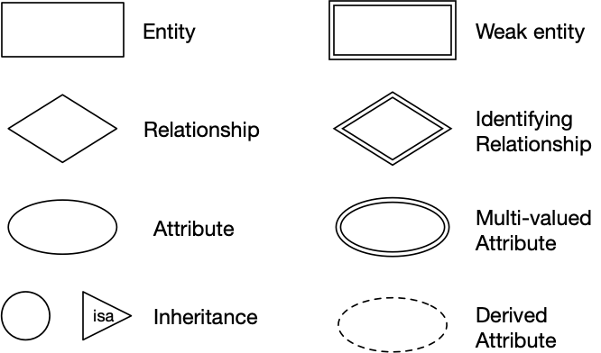

# COMP3311 Notes

<small class="written-by">
  Written by <a href="https://github.com/jeremyle56">Jeremy Le</a> on April 27 2023. Heavily inspired by <a href="https://lukakerr.github.io/uni/3311-notes">Luka Kerr's </a> Notes.
</small>

## Table of Contents

1. [Data Modelling](#data-modelling)
2. [Entity-Relationship Data Modelling (ER Model)](#entity-relationship-data-modelling)
   - [ER Diagrams](#er-diagrams)
     - [Entities](#entities)
     - [Relationship Sets](#relationship-sets)
     - [Class Hierarchies](#class-hierarchies)
3. [Relational Model](#relational-model)
   - [Constraints](#constraints)
4. [Relational DMBSs](#relational-dmbss)
   - [Managing Databases](#managing-databases)
   - [SQL](#sql)
     - [Syntax](#syntax)
     - [Managing Tables](#managing-tables)
     - [Managing Tuples](#managing-tuples)
     - [Types](#types)
     - [String Comparison](#string-comparison)
     - [String Manipulation](#string-manipulation)
     - [Queries](#queries)
     - [Views](#views)
5. [Programming With SQL](#programming-with-sql)
   - [PostgreSQL Stored Procedures](#postgresql-stored-procedures)
     - [Function Return Types](#function-return-types)
   - [SQL Functions](#sql-functions)
   - [PLpgSQL](#plpgsql)
     - [Syntax](#syntax-1)
     - [`SELECT ... INTO`](#select--into)
   - [Aggregates](#aggregates)
     - [PostgreSQL User Defined Aggregates](#postgresql-user-defined-aggregates)
       - [User Defined `count()`](#user-defined-count)
   - [Constraints](#constraints-1)
   - [Assertions](#assertions)
   - [Triggers](#triggers)
     - [Semantics](#semantics)
6. [Programming With Databases](#programming-with-databases)
   - [Python & Psycopg2](#python--psycopg2)
7. [Relational Design Theory](#relational-design-theory)

## Data Modelling

Data modelling is a design process which converts requirements into a data model.

The aims of data modelling are to:

- describe what _information_ is contained in the database
- describe _relationships_ between data items
- describe _constraints_ on data

## Entity-Relationship Data Modelling (ER Model)

The world is viewed as a collection of inter-related entities.

ER has three major modelling constructs:

1. Attribute: data item describing a property of interest
2. Entity: collection of attributes describing object of interest
3. Relationship: association between entities (objects)

### ER Diagrams

ER diagrams are a graphical tool for data modelling.

An ER diagram consists of:

- a collection of entity set definitions
- a collection of relationship set definitions
- attributes associated with entity and relationship sets
- connections between entity and relationship sets

Key = set of attributes that uniquely identifies each entity instance

ER design elements:



#### Entities

An entity can be viewed as either a set of entities with the same set of attributes or an abstract description of a class of entities.

#### Relationship Sets

A relationship is an association among several entities. A relationship set is a collection of relationships of the same type.

Relationships contain

- **Degree**: the number of entities involved in the relationship
- **Cardinality**: the number of associated entities
  - one-to-one (`[entity]<--(rel)-->[entity]`)
  - one-to-many (`[entity]<--(rel)---[entity]`)
  - many-to-many (`[entity]---(rel)---[entity]`)
- **Participation**: whether every entity must be in the relationship
  - total participation (thick line)
  - partial participation (thin line)


#### Class Hierarchies

ER also implements super-class / sub-class hierarchies

- both super- and sub-classes consist of entities
- super-class has common properties of all entities in hierarchy
- sub-classes can add extra properties to specialise
- entities in super-class may have corresponding entities in sub-class
- sub-classes can be
  - _disjoint_ (entities are members of only one sub-class)
  - _overlapping_ (entities are members of several sub-classes)

## Relational Model

A relational model contains

- Tuples are collections of values
- Relations are set of tuples
- Constraints are logical statements on valid data

Tuples correspond to entities whilst relations correspond to entity sets and relationships.

### Constraints

There are different types of constraints

- unique = value of attribute is unique in relation
- key = chosen unique attribute to distinguish tuples
- domain = type of attribute, restrictions within type
- referential integrity = foreign key
  - tuple in relation R has attribute F
  - whose value corresponds to key attribute K in relation S

## Relational DMBSs

A _relational database management system_ (RDBMS)

### Managing Databases

```bash
# Create a new, empty database
$ createdb dbname

# Drop and remove all data from a database
$ dropdb dbname

# Dump the contents of a database
$ pg_dump dbname > dumpfile

# Restore the contents of a database dump
$ psql dbname -f dumpfile
```

### SQL

SQL is a Data Definition Language that can formalise relational schemas.

```sql
CREATE TABLE TableName (
  attrName1 domain1 constraints1,
  attrName2 domain2 constraints2,
  ...
  PRIMARY KEY (attri, attrj,...)
  FOREIGN KEY (attrx, attry,...)
              REFERENCES
              OtherTable (attrm, attrn,...)
);
```

#### Syntax

```sql
-- Comments are after two dashes

-- Identifiers are alphanumeric and can be inside double quotes
-- Identifiers are case insensitive
"An Identifier", AnIdentifier

-- There are many keywords
CREATE, SELECT, TABLE, WHERE

-- Strings are inside single quotes
'a string'

-- Numbers are similar to C
1, -5, 3.14159

-- There are multiple types
integer, float, char(n), varchar(n), date

-- There are multiple operators
=, <>, <, <=, >, >=, AND, OR, NOT
```

#### Managing Tables

```sql
-- Create a table with attributes and constraints
CREATE TABLE table (Attributes + Constraints)

-- Modify a table
ALTER TABLE table TableSchemaChanges

-- Drop a table
DROP TABLE table(s) [ CASCADE ]

-- Truncate a table
TRUNCATE TABLE table(s) [ CASCADE ]
```

#### Managing Tuples

```sql
-- Insert into a table
INSERT INTO table (Attrs) Values Tuple(s)

-- Delete from a table
DELETE FROM table WHERE condition

-- Update a table
UPDATE table SET AttrValueChanges WHERE condition
```

where

- `Attrs` = `(attr1, attr2, ..., attrn)`
- `Tuple` = `(val1, val2, ..., valn)`
- `AttrValueChanges` is a comma separated list of `attrname = expression`

#### Types

```sql
-- Define own constrained type
CREATE DOMAIN Name AS Type CHECK (Constraint)

-- Define tuple type
CREATE TYPE Name AS (AttrName AttrType, ...)

-- Define enumerated type
CREATE TYPE Name AS ENUM ('Label', ...)
```

#### String Comparison

- `a < b` compares strings `a` and `b` using dictionary order
- `a LIKE pattern` matches string `a` to pattern
- `%` matches anything
- `_` matches a single char

PostgreSQL provides regexp-based pattern matching.

```sql
-- ~ and !
Attr ~ 'RegExp'     -- Matches 'RegExp'
Attr !~ 'RegExp'    -- Doesn't match 'RegExp'

-- ~* and !~*
Attr ~* 'RegExp'    -- Matches 'RegExp' case-insensitive
Attr !~* 'RegExp'   -- Doesn't match 'RegExp' case-insensitive
```

#### String Manipulation

```sql
-- Concatenate a and b
a || b

-- Lowercase a
lower(a)

-- Extract substring from a
substring(a, start, count)
```

#### Queries

An SQL query consists of a sequence of clauses:

```sql
SELECT   projectionList
FROM     relations/joins
WHERE    condition
GROUP BY groupingAttributes
HAVING   groupCondition
```

The `FROM`, `WHERE`, `GROUP BY` and `HAVING` clauses are optional.

#### Views

A view associates a name with a query. Each time the view is invoked (in a `FROM` clause) the query is evaluated, yielding a set of tuples. The set of tuples is used as the value of the view.

A view can be treated as a 'virtual table' and are useful for packaging a complex query to use in other queries.

```sql
CREATE VIEW viewName [(attributes)] AS Query
```

## Programming With SQL

### PostgreSQL Stored Procedures

The PostgreSQL syntax for defining stored _functions_:

```sql
CREATE OR REPLACE FUNCTION
  funcName(arg1, arg2, ...) RETURNS retType
AS $$
String containing function definition
$$ LANGUAGE funcDefLanguage;
```

where

- `arg1, arg2, ...` consists of `name type`
- `$$ ... $$` are just a type of string quote
- `LANGUAGE` is a function definition language (e.g. Python, SQL, PLpgSQL)

#### Function Return Types

A PostgreSQL function can return a value which is

- `void`
- An atomic data type (`integer`, `text`, ...)
- A tuple
- A set of atomic values (`setof integer`, ...)
- A set of tuples (`setof Employee` where `Employee` is a tuple)

A function returning a set of values is similar to a view.

### SQL Functions

PostgreSQL allows functions to be defined in SQL:

```sql
CREATE OR REPLACE
  funcName(arg1type, arg2type, ...)
  RETURNS retType
AS $$
  SQL statements
$$ LANGUAGE sql;
```

Within the function, arguments are accessed as `$1, $2, ...` corresponding to their position in the function definition.

A parameterless function behaves similar to a view.

### PLpgSQL

PLpgSQL stands for **P**rocedural **L**anguage extensions to **P**ost**g**re**SQL**. It is a PostgreSQL-specific language integrating features of procedural programming and SQL programming.

It provides a means for extending DBMS functionality, specifically it

- Implements constraint checking (triggered functions)
- Has complex query evaluation (e.g. recursive)
- Has complex computation of column values
- Has detailed control of displayed results

PLpgSQL functions are created (and inserted into db) via:

```sql
CREATE OR REPLACE
  funcName(param1, param2, ...)
  RETURNS retType
AS $$
DECLARE
   variable declarations
BEGIN
   code for function
END;
$$ LANGUAGE plpgsql;
```

The entire function body is stored as a single SQL string.

#### Syntax

```sql
-- Assignment
var := exp
SELECT exp INTO var

-- Selection
IF C1 THEN S1
ELSIF C2 THEN S2 ...
ELSE S END IF

-- Iteration
LOOP S END LOOP
WHILE C LOOP S END LOOP
FOR rec_var IN Query LOOP ...
FOR int_var IN lo..hi LOOP ...
```

##### `SELECT ... INTO`

Can capture query results via

```sql
SELECT Exp1, Exp2, ..., ExpN
INTO   Var1, Var2, ..., VarN
FROM   TableList
WHERE  Condition ...
```

where the query is executed as usual, a projection list is returned as usual and each `ExpI` is assigned corresponding to each `VarI`.

### Aggregates

Aggregates reduce a collection of values into a single result.

The action of an aggregate function can be viewed as

```c
State = initial state for each item V {
  // update State to include V
  State = updateState(State, V)
}
return makeFinal(State)
```

#### PostgreSQL User Defined Aggregates

The SQL standard does not specify user-defined aggregates, but PostgreSQL does provides a mechanism for defining them.

To define a new aggregate, we need to supply

- A `BaseType`, the type of input values
- A `StateType`, the type of intermediate states
- A state mapping function `sfunc(state, value) -> newState`
- Optionally, an initial state value (defaults to `NULL`)
- Optionally, a final function `ffunc(state) -> result`

Aggregates are created using the `CREATE AGGREGATE` statement:

```sql
CREATE AGGREGATE AggName(BaseType) (
  sfunc = UpdateStateFunction,
  stype = StateType,
  initcond = InitialValue,
  finalfunc = MakeFinalFunction,
  sortop = OrderingOperator
);
```

where

- `initcond` (with type `StateType`) is optional; defaults to `NULL`
- `finalfunc` is optional; defaults to identity function
- `sortop` is optional; needed for min/max-type aggregates

##### User Defined `count()`

```sql
CREATE AGGREGATE myCount(anyelement) (
  stype = int,
  initcond = 0,
  sfunc = oneMore
);

CREATE FUNCTION oneMore(sum int, x anyelement) RETURNS int
AS $$
  BEGIN
    RETURN sum + 1;
  END;
$$ LANGUAGE PLPGSQL;
```

### Constraints

Column and table constraints ensure validity of one table. Global constraints may involve conditions over many tables.

#### Assertions

SQL implementation of global constraints is `ASSERTION`

- Example: #students in any UNSW course must be < 10000

```sql
create assertion ClassSizeConstraint check (
   not exists (
      select c.id
      from   Courses c
             join Enrolments e on (c.id = e.course)
      group  by c.id
      having count(e.student) > 9999
   )
);
```

This is too expensive, so DBMSs provide _triggers_ to do targetted checking.

#### Triggers

Triggers are procedures stored in the database that are activated in response to database events.

Triggers provide event-condition-action (ECA) programming where

- An _event_ activates the trigger
- A _condition_ is checked
- If the condition holds, an _action_ is executed

To define a trigger, we use the syntax

```sql
CREATE TRIGGER TriggerName
{AFTER|BEFORE} Event1 [ OR Event2 ... ]
[ FOR EACH ROW ]
ON TableName
[ WHEN ( Condition ) ]
Block of Procedural/SQL Code;
```

Possible `Event`s are `INSERT`, `DELETE`, `UPDATE`.

##### Semantics

Triggers can be activated `BEFORE` or `AFTER` the event.

If activated `BEFORE`

- A value `NEW` contains the "proposed" value of changed tuple
- Modifying `NEW` causes a different value to be placed in the database

If activated `AFTER`

- `NEW` contains the current value of the changed tuple
- A value `OLD` contains the previous value of the changed tuple
- Constraint checking _has_ been done for `NEW`

## Programming With Databases

A common database access pattern used in programming languages is seen below.

```python
db = connect_to_dbms(DBname, User/Password)

query = build_SQL('SQLStatementTemplate', values)

results = execute_query(db, query)

while more_tuples_in(results):
  tuple = fetch_row_from(results)
  # do something with values in tuple
```

### Python & Psycopg2

Psycopg2 is a Python module that provides

- A method to connect to PostgreSQL databases
- A collection of DB-related exceptions
- A collection of type and object constructors

A standard Psycopg2 program is seen below.

```python
import psycopg2

conn = psycopg2.connect(DB_connection_string)

cur = conn.cursor()

cur.execute('SQLStatementTemplate', values)

conn.close()
```

Psycopg2 has various useful methods

- `conn.commit()`
  - Commit changes made to the database since last `commit()`
- `cur.mogrify('SQLStatementTemplate', values)`
  - Returns the SQL statement as a string with values inserted
- `cur.fetchall()`
  - Returns a list of tuples
- `cur.fetchone()`
  - Returns a single tuple
- `cur.fetchmany(nTuples)`
  - Returns `nTuples` amount of tuples

## Relational Design Theory

A good relational database design is

- accurate (represent scenario faithfully)
- complete (represent all aspects of a scenario)
- minimal (minimise stored data; no redundancy)

Relational design theory address the last issue, relying on the notion of functional dependency.

### Relational Design and Redundancy

In database design, redundancy is generally a "bad thing" as it makes it difficult to maintain consistency after updates. Our goal is to reduce redundancy in sorted data by ensuring that the schema is structured appropriately.

### Functional Dependency

A relation instance $r(R)$ satisfies a dependency $X \to Y$ if for any $t, u \in r, t[X] = u[X] \implies t[Y] = u[Y]$.

In other words, if two tuples in $R$ agree in their values for the set of attributes $X$, then theymust also agree in their values for the set of attributes $Y$. In this case we say that "$Y$ is functionally dependent on $X".

Attribute sets $X$ and $Y$ may overlap, and it is trivially true that $X \to X$.

#### Inference Rules

Armstrong's rules are general rules of inference on functional dependencies.

- **Reflexivity**: $X \to X$
- **Augmentation**: $X \to Y \implies XZ \to YZ$
- **Transitivity**: $X \to Y, Y \to Z \implies X \to Z$

Other useful rules exist too.

- **Additivity**: $X \to Y, X \to Z \implies X \to YZ$
- **Projectivity**: $X \to YZ \implies X \to Y, Y \to Z$
- **Pseudotransitivity**: $X \to Y, YZ \to W \implies XZ \to W$

#### Closure

Given a set $F$ of functional dependencies, how many new functional dependencies can we derive? For a finite set of attributes, there must be a finite set of derivable functional dependencies.

The largest collection of dependencies that can be derived from $F$ is called the _closure_ of $F$ and is denoted $F^+$.

## Normalisation

Normalisation: branch of relational theory providing design insights.
Makes use of schema normal forms to characterise the level of redundancy in a relational schema and normalisation algorithms which provide mechanisms for transforming schemas to remove redundancy.

### Normal Forms

Normalisation theory defines six normal forms (NFs).

- First, Second, Third Normal Forms (1NF, 2NF, 3NF)
- Boyce-Codd Normal Form (BCNF)
- Fourth Normal Form (4NF)
- Fifth Normal Form (5NF)

1NF allows most redundancy and 5NF allows the least redundancy.

Normalisation aims to put a schema into xNF by ensuring that all relations in the schema are in xNF.

- 1NF: all attributes have atomic values, apart of relational model. Every relational schema is in 1NF.
- 2NF: all non-key attributes fully depend on key (i.e. no partial dependencies)
- 3NF/BCNF: No attributes dependent on non-key attributes (i.e. no transitive dependencies)

Boyce-Codd Normal Form (BCNF):

- eliminates all redundancy due to functional dependencies
- but may not preserve original functional dependencies

Third Normal Form (3NF):

- eliminates most (but not all) redundancy due to functional dependencies
- guaranteed to preserve all functional dependencies

#### Relation Decomposition

The standard transformation technique to remove redundancy is to decompose relation $R$ into relations $S$ and $T$.

We accomplish decomposition by

- selecting (overlapping) subsets of attributes
- forming new relations based on attribute subsets

Properties include $R = S \cup T, S \cap T \neq \emptyset$ and $r(R) = S(S) \bowtie t(T)$.

#### Boyce-Codd Normal Form

A relational schema $R$ is in BCNF with respect to a set $F$ of functional dependencies iff:

for all functional dependencies $X \to Y$ in $F^+$:

- either $X \to Y$ is trivial (i.e. $Y \subset X$)
- or $X$ is a superkey

A DB schema is in BCNF if all of its relation schemas are in BCNF.

If we transform a schema into BCNF, we are guaranteed:

- no update anomalies due to fd-based redundancy
- lossless join decomposition

However, we are not guaranteed:

- the new schema preserves all fds from the original schema

If we need to preserve dependencies, use 3NF

The following algorithm converts an arbitrary schema to BCNF.

```python
# Inputs: schema R, set F of functional dependencies
# Output: set Res of BCNF schemas

Res = {R};

while any schema S in Res is not in BCNF:
  choose any fd X -> Y on S that violates BCNF
  Res = (Res-S) union (S-Y) union XY
```

A relation schema $R$ is in 3NF with respect to a set $F$ of functional dependencies iff:

for all functional dependencies $X \to Y$ in $F^+$:

- either $X \to Y$ is trivial (i.e. $Y \subset X$)
- or $X$ is a superkey
- or $Y$ is a single attribute from a key

A DB schema is in 3NF if all relation schemas are in 3NF.

If we transform a schema into 3NF, we are guaranteed:

- lossless join decomposition
- the new schema preserves all of the fds from the original schema

However, we are not guaranteed:

- no update anomalies due to fd-based redundancy

Whether to use BCNF or 3NF depends on overall design considerations.

The following algorithm converts an arbitrary schema to 3NF.

```python
# Inputs: schema R, set F of fds
# Output: set R_i of 3NF schemas

let F_c be a minimal cover for F

Res = {}

for each fd X -> Y in F_c:
  if no schema S in Res contains XY:
    Res = Res union XY

if no schema S in Res contains a candidate key for R:
  K = any candidate key for R
  Res = Res union K
```

## Relational Algebra

Relational algebra (RA) can be viewed as a

- mathematical system for manipulating relations, or
- data manipulation language (DML) for the relational model

Relational algebra consists of

- operands: relations, or variables representing relations
- operators that map relations to relations
- rules for combining operands/operators into expressions
- rules for evaluating such expressions

Core relational algebra operations:

- _Selection_: choosing a subset of tuples/rows
- _Projection_: choosing a subset of attributes/columns
- _Product, Join_: combining relations
- _Union, Intersection, Difference_: combining relations
- _Rename_: change names of relations/attributes

### Notation

| Operation  | Standard Notation            | Our Notation                   |
| ---------- | ---------------------------- | ------------------------------ |
| Selection  | $\sigma_{expr}(Rel)$         | $Sel[expr](Rel)$               |
| Projection | $\pi_{A, B, B}(Rel)$         | $Proj[A, B, C](Rel)$           |
| Join       | $Rel_1 \bowtie_{expr} Rel_2$ | $Rel_1 \, Join[expr] \, Rel_2$ |
| Rename     | $\rho_{schema} Rel$          | $Rename[schema](Rel)$          |

We define the semantics of RA operations using

- conditional set expressions e.g. $\{X \mid \text{condition on } X\}$
- tuple notations:
  - $t[AB]$ (extracts attributes $A$ and $B$ from tuple $t$)
  - $(x,y,z)$ (enumerated tuples; specify attribute values)
- quantifiers, set operations, boolean operators

In the following, `+` is used instead of $\cup$ in the pseudocode but both mean the same thing as they are sets.

### Selection

Selection $Sel[C](r)$ returns a subset of the tuples in a relation $r(R)$ that satisfy a specified condition $C$.

```python
result = {}

for each tuple t in relation r:
  if C(t):
    result = result + {t}
```

### Projection

Projection $Proj[X](r)$ returns a set of tuples containing a subset of the attributes in the original relation, where $X$ specifies a subset of the attributes of $R$.

In pseudocode

```python
result = {}

for each tuple t in relation r:
  result = result + {t[X]}
```

### Product

Product $r \times s$ combines information from two relations pairwise on tuples.

In pseudocode

```python
result = {}

for each tuple t1 in relation r:
  for each tuple t2 in relation s:
    result = result + {(t1:t2)}
```

### Natural Join

Natural join $r \ Join \ s$ is a specialised product. It contains only pairs that match on common attributes with one of each pair of common attributes eliminated.

In pseusocode

```python
result = {}

for each tuple t1 in relation r:
  for each tuple t2 in relation s:
    if matches(t1, t2):
      result = result + {combine(t1, t2)}
```

### Theta Join

Theta join $r \ Join[C] \ s$ is a specialised product containing only pairs that match on a supplied condition $C$.

### Rename

Rename provides "schema mapping". If expression $E$ returns a relation $R(A_1, A_2, \dots, A_n)$ then $Rename[S(B_1, B_2, \dots, B_n)](E)$ gives a relation called $S$ containing the same set of tuples as $E$ but with the name of each attribute changed from $A_i$ to $A_b$.

### Union

Union $r_1 \cup r_2$ combines two compatible relations into a single relation via set union of sets of tuples.

In pseudocode

```python
result = r1

for each tuple t in relation r2:
  result = result + {t}
```

### Intersection

Intersection $r_1 \cap r_2$ combines two compatible relations into a single relation via set intersection of sets of tuples.

In pseudocode

```python
result = {}

for each tuple t in relation r1:
  if t in r2:
    result = result + {t}
```

### Difference

Difference $r_1 - r_2$ finds the set of tuples that exist in one relation but do not occur in a second compatible relation.

In pseudocode

```python
result = {}

for each tuple t in relation r1:
  if t not in r2:
    result = result + {t}
```

### Product

Product (Cartesian product) $r \times s$ combines information from two relations pairwise on tuples.

If $t_1 = (A_1 \dots A_n)$ and $t_2 = (B_1 \dots B_n)$ then $(t_1:t_2) = (A_1 \dots A_n, B_1 \dots B_n)$

In pseudocode

```python
result = {}

for each tuple t1 in relation r
  for each tuple t2 in relation s
    result = result + {(t1:t2)}
```

### Division

Division $r \ Div \ s$ considers each subset of tuples in a relation $R$ that match on $t[R - S]$ for a relation $S$. For this subset of tuples, it takes the $t[S]$ values from each, and if this covers all tuples in $S$, then it includes $t[R - S]$ in the result.

We have $r \ Div \ s = \{ t : t \in r[R - S] \land \text{satisfy} \}$ where $\text{satisfy} = \forall t_s \in S (\exists t_r \in R (t_r[S] = t_s \land t_r[R-S] = t))$.

Operationally:

- consider each subset of tuples in $R$ that match on $t[R-S]$
- for this subset of tuples, take the $t[S]$ values from each
- if this covers all tuples in $S$, then include $t[R-S]$ in the result
