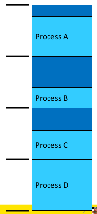
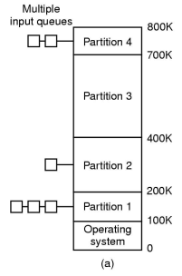
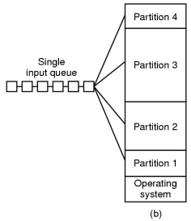
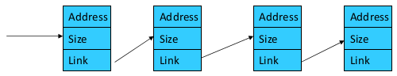
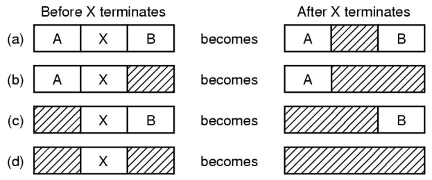
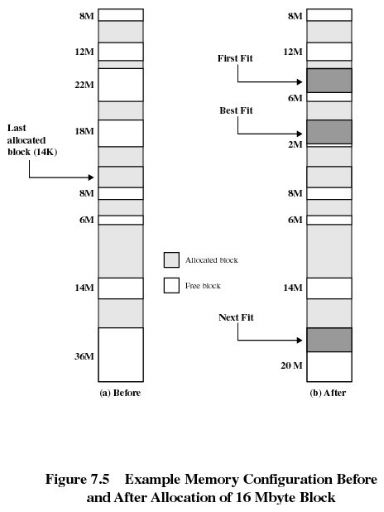
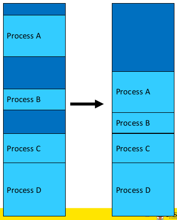
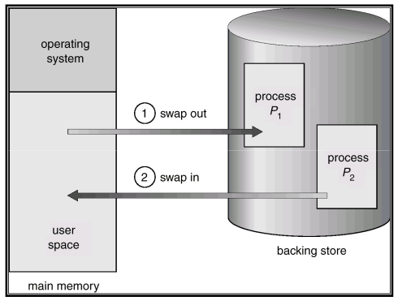

# Memory Management

The operating system keeps track of what memory is in use and what memory is free. It allocates free memory to processes when needed and deallocates when it isn't needed.

## Basic Memory Management (Monoprograming)

Monoprogramming without swapping or paging. There are three simple ways of organising memory for an operating system with one user process.

## Multiprogramming

We can subdivide memory and run more than one process at once. This is known as multiprogramming or multitasking.

Given a workload, we need to keep track of the free memory and locate free memory for a new process.

The overview of evolution of simple memory management:

- **static** (fixed partitioning) approaches - simple, predictable workloads of early computing
- **dynamic** (partitioning) approaches - more flexible computing as computing power and complexity increased

### Fixed Partitioning

Fixed partitioning is simple and easy to implement however results in poor memory utilisation due to internal fragmentations.

**Approach 1**: Divide memory into **_fixed equal-sized_** partitions. Any process smaller than or equal to the partition size can be loaded into any partition. Any unused space in the partition is wasted (internal fragmentation). Processes smaller than main memory but larger than a partition cannot run.

**Approach 2:**: We divide memory at boot time into a selection of **_fixed, variable-sized_** partitions. We can base the sizes on expected workloads. Each partition has a queue and we place a process in the queue for the smallest partition that it fits in. Processes then wait for when the assigned partition is empty to start.

Some partitions may be idle, but a different partition is free. Workloads are unpredictable and may not be efficiently used.

**Approach 3:** \***\*Fixed variable-sized\*\*** partitions with a **_single queue_**. We search for a partition that fits the job, small jobs may be allocated large partitions increasing internal memory fragmentation.

### Dynamic Partitioning

In dynamic partitioning, partitions are of **_variable length_** and are allocated **_on-demand_** from ranges of free memory. A process is allocated exactly what it needs and it is assumed a process knows what it needs.

In the diagram above, we have 16MB free at (h), but it can't be used to run any more processes requiring more than 6MB as it is fragmented. Hence we have external fragmentation since we have unusable holes.

Dynamic partition allocation algorithms are also applicable to `malloc()` like in-application allocators. Given a region of memory, basic requirements are:

- quickly locate a free partition satisfying the request (minimise CPU time search)
- minimise external fragmentation
- minimise memory overhead of bookkeeping
- efficiently support merging two adjacent free partitions into a larger partition

A classic approach to keep track of free memory is to represent available memory as a linked list of available "holes" (free memory ranges). For each hole we store the base and size and keep the holes in order of increasing address. This simplifies the merging of adjacent holes into larger holes. The list nodes are stored in the "holes" themselves.

As a result there are four neighbour combinations for the terminating process X when we want to coalesce free partitions in a linked list.

**Approach 1:** First-fit algorithm
We scan the list for the first entry that fits. If the size is greater, we break it into an allocated and free part. The intent is to minimise the amount of searching performed.
This aims to find a match quickly and biases allocation to the beginning of memory and tends to preserve larger blocks at the end of memory.

**Approach 2:** Next-fit algorithm
Like first-fit, except it begins its search from the point in the list where the last request succeeded instead of at the beginning.
This has (flawed) the intuition of spreading allocation more uniformly over the entire memory to avoid skipping over small holes at the start of memory. It performs worst that first-fit as it breaks up the large free space at the end of memory.

**Approach 3:** Best-fit algorithm
Chooses the block that is closest in size to the request
It performs worse that first-fit because it has to search the entire list. Since the smallest block is chosen for a process, the smallest amount of external fragmentation is left, creating a lot of unusable holes.

**Approach 4:** Worst-fit algorithm
Chooses the block that is the largest in size (worst-fit). The idea is to leave a unusable fragment left over.
It is also a poor performer since it has more work to do (like best-fit) to search the entire list. It also does not result in significantly less fragmentation.

First-fit is generally a better solution than the others and is easier to implement. Note that these have been largely superseded by m,ore complex and specific allocation strategies.

### Compaction

If we shuffle memory contents to place all free memory together in one large block we can reduce external fragmentation. We can do this only if we relocate running programs which generally requires hardware support.

### Relocation and Protection

To prevent processes from interfering with each other from different locations in memory we have logical addresses refer to locations within the program. Once running, these address must refer to the real physical memory.

- **compile/link time** - the compiler/linker binds the address and must know the "run" location at compile time (in other words the executable contains the corresponding physical addresses for the process). This means we can only **_run one copy_** of the process and it can only **_run at one_** location. We need to recompile if the location changes
- **load time** - the compiler generates **_relocatable_** code. Addresses are annotated and the loader binds the address to the correct location at load time. This slows start up and increases the executable file size
- **run time** - logical compile-time addresses are translated to physical addresses by _special hardware_. The cost of translating every memory reference is high

**Information about Hardware Support for Runtime Binding and Protection has been admitted.**

## Swapping

We need more than just a small number of processes running at once. We need to support a mix of active and inactive processes of varying longevity

A process can be **swapped** temporarily out of memory to a **backing store** and then brought back into memory for continued execution.
The **backing store** is a fast disk large enough to accommodate copies of all memory images for all users. It must provide direct access to these memory images.
We can prioritised processes; lower-priority processes can be swapped out so that a higher-priority process can be loaded and executed.
A major part of swap time is transfer time; the total transfer time is directly proportional to the _amount_ of memory swapped.

