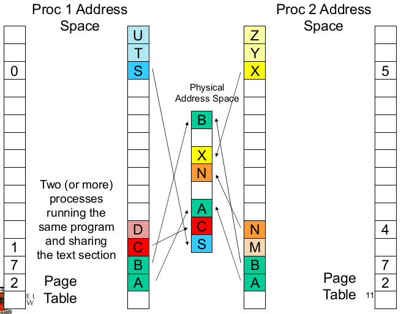
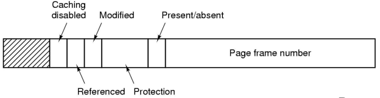
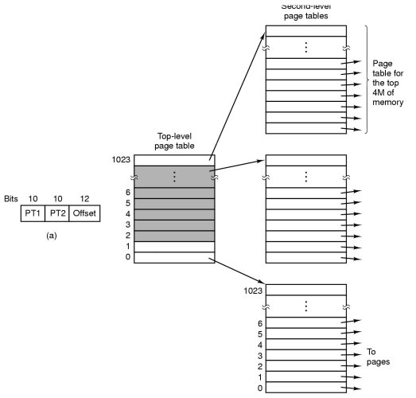
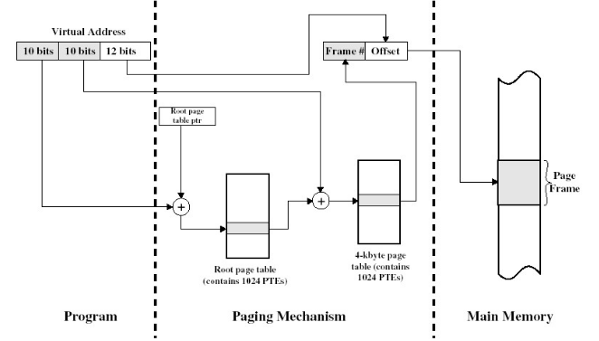
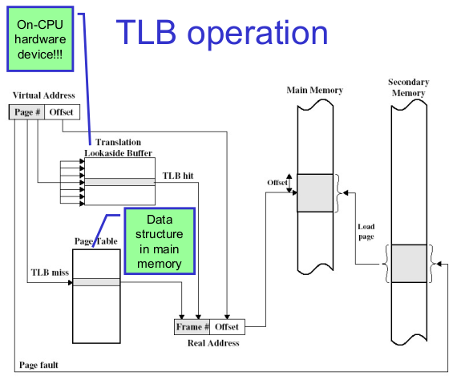
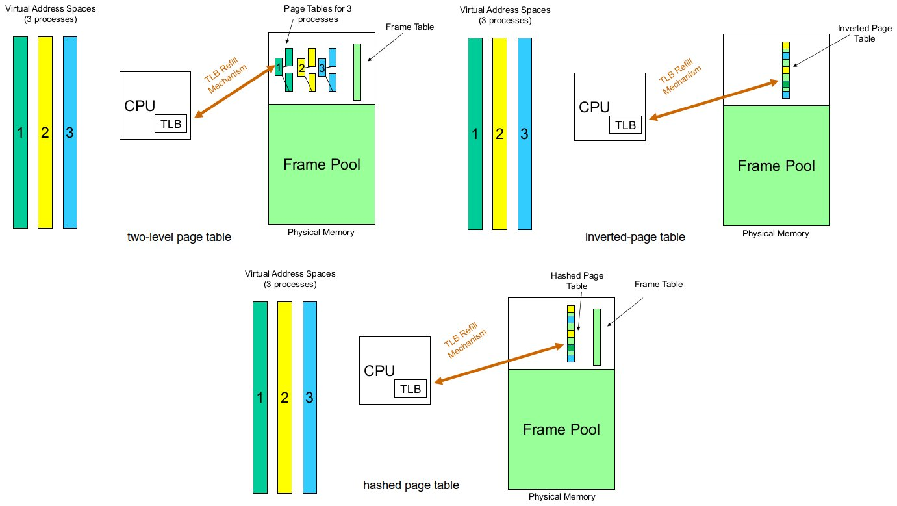

# Virtual Memory

## Introduction

**Virtual Memory** was developed to address the issues identified with the simple schemes. There are two variants: paging and segmentation. Paging is the dominant one of the two but some architectures supports hybrids of the two schemes.

### Paging

In paging we partition physical memory into small equal sized chunks called **_frames_**. We divide each process' virtual (logical) address space into same sized chunks called **_pages_**. Virtual memory addresses consist of a _page number_ and _offset within the page_.

The operating system maintains a **page table**, which contains the frame location for each page. It is used by _hardware_ to translate each virtual address to a physical address. The relation between virtual addresses and physical memory addresses is given by the page table.

In paging the process' physical memory does **not** have to be contiguous.

Paging has no external fragmentation, although it will have a small amount of internal fragmentation (especially for the last page). It allows sharing by _mapping_ several pages to the same frame. Paging abstracts physical organisation since the programmer only deals with virtual addresses. There is minimal support for logical operations since each unit if one or more pages.

### Memory Management Unit (MMU)

The **Memory Management Unit (MMU)** is also called **Translations Look-aside Buffer (TLB)**. It is connected to the CPU, which sends virtual addresses to the MMU. The MMU translates the given logical addresses to physical address in memory.

## Overview

**Virtual memory** is divided into equal sized **_pages_**.
A **_mapping_** is a translation between a page and a frame, and a page and null. Mappings are defined at runtime, although they can change.
The address space can have holes.
The process does not have to be contiguous in physical memory.

The **physical memory** is divided into **_frames_**.

A typical address space layout consists of:

- the stack region at the top, growing down
- the heap as free space, growing up
- text as (typically) read-only
- the kernel reserved and protected as a shared region

The 0th page is typically not used as `NULL` pointers generally point to this address and if accessed can be successfully dereferenced.

A process may be only partially resident (i.e. loaded to the physical address space). This allows the OS to store individual pages on disk and saves memory for infrequently used data and code.

If we access non-resident memory, we will get a **page fault**. This occurs when we reference an invalid page and is an exception handled by the OS.  
Broadly there are two standard page fault types:

- **illegal address** (protection error) - signals or kills the process
- **page not resident** - will
  1. get an empty frame
  2. load the page
  3. update the page (translation) table (enter frame#, set valid bit, etc.)
  4. restart the faulting instruction

A page table for resident parts of the address space:

### Shared Pages

Generally each procress has their own copy of code and data, which can appear anywhere in the address space. It is possible to have shared code where a single copy of code is shared between all processes executing it. The code itself **must not be self modifying** and **must appear at the same address in all processes**.

### Page Table Structure

A **page table** is an array of frame numbers indexed by a page number. Each **page-table entry (PTE)** also has other bits:

- **present/absent bit** - also called a **valid bit**, which indicated a valid mapping for the page
- **modified bit** - also called a **dirty bit**, which indicates that a page may have been modified in memory; useful for loading blocks from disk; e.g. if a block has not been modified, we do not need to retrieve it from the disk
- **reference bit** - indicates the page has been accessed; useful for choosing which pages to remove
- **protection bit** - a combination of read, write, execute permissions
- **caching bit** - used to indicate whether the processor should bypass the cache when accessing memory; e.g. to access device registers or memory

### Address Translation

Every (virtual) memory address issued by the CPU must be translated to physical memory; every _load_ and every _store_ instruction, every instruction fetch. To be able to do this be need translation hardware.

In the paging system, translation involves replacing the page number with a frame number.

## Page Tables

Assume we have:

- a 32-bit virtual address (2^32 = 4 Gbyte address space)
- 4 Kbyte page size

We would have `2^32 / 2^12 = 2^20` page table entries each with a `2^12` offset.

Now, assume we have:

- a 62-bit virtual address space (a humongous address space)
- 4 Kbyte page size

We would have `2^64 / 2^12 = 2^52` page table entries.

Our page table would be **very** large.

Page tables are implemented as data structures in main memory. Most processes do not use the full 4GB address space; e.g. 0.1 – 1 MB text, 0.1 – 10 MB data, 0.1 MB stack

We need a compact representation that does not waste space, but is still very fast to search. There are three basic schemes:

- use data structure that adapt to sparsity
- use data structures which only represent resident pages
- use VM techniques for page tables (covered in extended OS)

### Two-level Page Table

The **two-level page table** is a page table which adapts to sparsity. Unmapped pages are not allocated.

Instead of accessing the page table via a single page number, we split the page number into high-order and low-order bits, and use those bits to index the **top-level** and **second-level** page tables respectively.

### Inverted Page Table

An **inverted page table (IPT)** has an array of page numbers indexed by frame numbers (it's a frame table).

The algorithm:

1. Compute the hash of a page number
2. Extract the index from the hash table
3. Use this index in the inverted page table
4. Match the PID and page number in the IPT entry
   1. If it matches, use the index value as the frame number fro translation
   2. If it doesn't match, get the next candidate IPT entry from the chain field
   3. If `NULL` chain entry, trigger a page fault

Given `n` processes, a 'normal' page table would have `n` page table while an inverted page table would only have `1`.

Sharing a page is 'easy' for normal page table, but troublesome to implement for inverted page tables.

### Hashed Page Table

We can improve the IPT with a **hashed paged table (HPT)**. It retains the fast lookup of IPT (a single memory reference in the best case) and retains the page table sized on physical (not virtual) memory size, while enabling efficient frame sharing and support for more than one mapping for the same frame.

Instead of obtaining a frame number from the hash function, it obtains an index to the page table which **contains** the physical frame number.

HPT size is generally based on physical memory size. With sharing, each frame can have more than one page table entry. More sharing increases the number of slots used (but also increases the likelihood of collision). We can tune the HPT size based on:

- physical memory size
- expected sharing
- hash collision avoidance

## Translation Look-aside Buffer

Given a virtual address, the processor examines the TLB.

1. If a matching PTE is found (a _TLB hit_), the address is translated.
2. Otherwise (a _TLB miss_), the page number is used to index the process's page table.
   1. If the page table contains a valid entry, reload the TLB and restart
   2. Otherwise (page fault), check if the page is on disk
      1. If on disk, swap it in
      2. Otherwise, allocate a new page or raise an exception

TLB properties:

- page table is (logically) an array of frame numbers
- TLB holds a (recently used) subset of page table entries
  - each TLB entry must be identified (tagged) with the page number it translates
  - access is by associative lookup; all TLB entries' tags are concurrently compared to the page number; TLB is associative (or content-addressable) memory
- may or may not be under direct OS control:
  - hardware-loaded TLB - on miss, hardware performs page table lookup and reloads TLB; e.g. x86, ARM
  - software-loaded TLB - on miss, hardware generates a TLB miss execption, and exception handler reloads TLB; e.g. MIPS, Itanium (optionally)
- TLB size is typically 64-128 entries
- can have separate TLBs for instruction fetch and data access
- TLBs can also be used with inverted page tables (and others)

Without TLB, the average number of physical memory references per virtual memory reference is `2`.  
With TLB (assuming there is a 99% hit ratio), the average number of physical memory references per virtual reference is `0.99*1 + 0.01*2 = 1.01`

### TLB and Context Switching

TLB is a shared piece of hardware. Normal page tables are per-process (address space) while TLB entries are _process-specific_. On a context switch, we can

- **flush** the TLB (invalidate all entries) at the cost of high context-switching ovehead (e.g. Intel x86)
- tag entries with **address-space ID (ASID** - called a _tagged TLB_; used (in some form) on all modern architectures
  TLB entry contains: ASID, page#, frame#, valid and write-protect bits

### Simplified Components of a Virtual Memory System

## MIPS R3000

